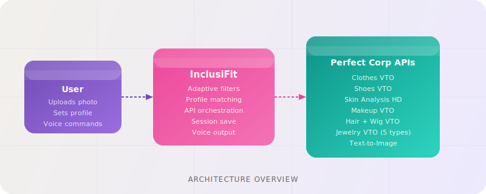

<p align="center">
  
</p>

<p align="center">
  <strong>AI-Powered Adaptive Fashion and Beauty for People with Disabilities</strong>
</p>

<p align="center">
  Built for the Perfect Corp x Startup World Cup Silicon Valley Hackathon 2026
</p>

<p align="center">
  
</p>

---

## The Problem

1.3 billion people globally have disabilities. They shop online more than anyone because physical stores are inaccessible, exhausting, or humiliating. Yet every e-commerce platform is built for one body type.

| Stat | Source |
|---|---|
| 71% abandon inaccessible e-commerce immediately | Business Disability Forum |
| 62% of disabled shoppers cannot find comfortable clothes | RIDC 2024 |
| $47.3B in adaptive clothing demand goes unmet in the US alone | Coresight Research |
| $8 trillion global disability spending power | Return on Disability |

The gap is not just filters. It is visualization. Even if you find an adaptive product, you cannot see how it looks on your body with shorter limbs, wider feet, an AFO brace, or a hearing aid. You order blind. You return. You give up.

InclusiFit fixes this. Disability-aware smart filters combined with Perfect Corp's AI/AR virtual try-on creates the first platform where people with disabilities can find clothes that fit their life and see how they look before buying.

---

## Solution

Two layers working together:

**Layer 1 - Adaptive Discovery Engine**

Smart filters that do not exist anywhere else:
- Closure type: magnetic snap, velcro, zip, button-free
- Waistband type: elastic, adjustable, rigid
- Fit style: loose, relaxed, compression
- Length: petite, standard, tall
- Footwear: AFO-compatible, wide width, small adult sizes
- Beauty: container type (pump, squeeze, twist), grip difficulty
- Voice commands: "show loose fit", "AFO only", "clear filters"

**Layer 2 - AI/AR Virtual Try-On (Perfect Corp YouCam API)**

After filtering, users see themselves in the product before buying.

---

## Perfect Corp APIs Integrated (13 total)

| API | Endpoint | Adaptive Use Case |
|---|---|---|
| AI Clothes VTO v3 | `/s2s/v2.0/task/cloth` | Proportional fit, loose fit, closure visualization |
| AI Shoes VTO | `/s2s/v2.0/task/shoes` | AFO-compatible footwear, wide and small sizes |
| AI Skin Analysis HD | `/s2s/v2.1/task/skin-analysis` | Accessible beauty recommendations |
| AI Makeup VTO | `/s2s/v2.0/task/makeup-vto` | Try before buying for motor disability |
| AI Hairstyle Generator | `/s2s/v2.0/task/hair-style` | Wig and hairpiece try-on for alopecia |
| AI Hair Color VTO | `/s2s/v2.0/task/hair-color` | Color try-on for wig shoppers |
| AI Earring VTO | `/s2s/v2.0/task/2d-vto/earring` | Hearing aid compatible jewelry |
| AI Ring VTO | `/s2s/v2.0/task/2d-vto/ring` | Jewelry try-on |
| AI Bracelet VTO | `/s2s/v2.0/task/2d-vto/bracelet` | Adaptive clasp jewelry |
| AI Watch VTO | `/s2s/v2.0/task/2d-vto/watch` | Easy-clasp watches |
| AI Necklace VTO | `/s2s/v2.0/task/2d-vto/necklace` | Magnetic clasp necklaces |
| AI Bag VTO | `/s2s/v2.0/task/bag` | Adaptive bag try-on |
| AI Hat VTO | `/s2s/v2.0/task/hat` | Hat try-on |
| AI Text-to-Image | `/s2s/v2.0/task/text-to-image` | Generate adaptive fashion visuals |
| AI Face Analyzer | `/s2s/v2.0/task/face-attr-analysis` | Face attributes for personalization |

---

## The Five User Journeys

**Journey 1: Shorter Limbs (Achondroplasia, Dwarfism)**
1. Profile: select "Shorter limbs"
2. Catalog auto-filters: petite length, high waist rise
3. Select dress, upload photo, AI Clothes VTO renders it on their body
4. See actual length on actual body before buying

**Journey 2: Limited Dexterity (Muscular Dystrophy, MS, Parkinson's)**
1. Profile: select "Limited dexterity"
2. Fashion filters: velcro/magnetic closures, elastic waistband, loose fit
3. Beauty filters: pump dispensers, easy-grip applicators
4. AI Clothes VTO confirms loose fit, AI Makeup VTO shows color before application

**Journey 3: AFO / Brace Users (GNE Myopathy, Cerebral Palsy)**
1. Profile: select "AFO / brace user"
2. Catalog shows only AFO-compatible footwear
3. Upload foot photo, AI Shoes VTO renders shoe on their foot

**Journey 4: Hair Loss (Alopecia, Cancer Treatment)**
1. Profile: select "Hair loss / wigs"
2. Upload selfie, AI Hairstyle Generator tries on wig styles
3. AI Hair Color VTO shows color options
4. Shop from home with privacy and confidence

**Journey 5: Visual Impairment**
1. AI Skin Analysis results read aloud via Web Speech API
2. Products recommended by concern and container type
3. Voice commands: "show loose fit", "read my results", "AFO only"
4. Screen reader compatible throughout

---

## Pages

| Page | URL | Description |
|---|---|---|
| Landing | `/` | Cinematic hero with glassmorphic panels |
| Onboarding | `/profile` | 3-step: welcome, interactive demo, condition selector |
| Dashboard | `/dashboard` | Quick actions, analytics, settings |
| Catalog | `/catalog` | 15 adaptive products, advanced filters, voice commands |
| AI Studio | `/studio` | Upload once, APIs run sequentially based on your profile |
| Clothes VTO | `/tryon` | Virtual try-on with before/after comparison |
| Shoes VTO | `/shoes` | AFO-compatible footwear try-on |
| Beauty | `/beauty` | Skin analysis and makeup VTO |
| Hair and Wigs | `/hair` | Hair color and wig style try-on |
| Accessories | `/accessories` | Ring, bracelet, watch, necklace, bag, hat VTO |

---

## Accessibility Features

| Feature | Who It Helps |
|---|---|
| Voice commands | Motor disability, visual impairment |
| Skin results read aloud (Web Speech API) | Visual impairment |
| Screen reader compatible (WCAG 2.1 AA) | Visual impairment |
| Large tap targets (min 44x44px) | Motor disability, tremors |
| Session save (localStorage) | Fatigue conditions (MS, ME/CFS) |
| Before/after comparison | All users |
| Free returns for users with disabilities | All users |
| Caregiver mode toggle | Severe motor disability |
| High contrast mode toggle | Low vision |

---

## Adaptive Product Catalog (15 products)

- **Clothing (5):** Adaptive Wrap Dress, Velcro Tunic, Pull-On Trousers, Magnetic Zip Jacket, Adaptive Midi Skirt
- **Footwear (3):** AFO-Compatible Sneaker, Wide-Fit Loafer, Adaptive Boot with Side Zip
- **Beauty (3):** Easy-Pump Foundation, Large-Grip Lip Color, Easy-Grip Mascara
- **Hair (2):** Natural Wave Wig, Short Pixie Wig
- **Jewelry (2):** Hearing Aid Friendly Studs, Magnetic Clasp Necklace

Each product is tagged with adaptive metadata: closure type, waistband, fit style, AFO compatibility, container type, grip difficulty.

---

## Photon Spectrum Integration

InclusiFit extends beyond the web app to messaging platforms via [Photon Spectrum](https://photon.codes). Users interact with InclusiFit directly in iMessage, WhatsApp, or Telegram without opening a browser.

### How it works

The bot lives in the `bot/` directory. It connects to Photon's hosted infrastructure and handles two types of input:

**Photo input:** User sends a selfie. The bot calls the Perfect Corp Skin Analysis API and returns scored results in the chat.

**Text commands:** User types a condition or category. The bot returns filtered adaptive product recommendations with direct links to the web app for virtual try-on.

### Example conversation

```
User:  hi

Bot:   Welcome to InclusiFit — adaptive fashion for everyone.

       Commands:
         afo         — AFO-compatible footwear
         loose       — Loose / easy-wear clothing
         dexterity   — Magnetic/velcro closures
         hair        — Wigs and hair loss products
         beauty      — Accessible beauty products
         shorter     — Petite / shorter limb clothing
         catalog     — Full product list

       Send a photo of your face for a free AI skin analysis.
       Web app: https://inclusift.vercel.app


User:  [sends selfie]

Bot:   Analyzing your skin with Perfect Corp AI... (takes ~15 seconds)

       Skin Analysis Results:

         Pores: 72/100
         Moisture: 85/100
         Radiance: 68/100
         Oiliness: 74/100

       For personalized recommendations: https://inclusift.vercel.app/beauty


User:  afo

Bot:   AFO-Compatible Footwear:

       - AFO-Compatible Sneaker ($129.99)
         Extra wide, fits over AFO braces, velcro
       - Wide-Fit Slip-On Loafer ($79.99)
         Wide fit, slip-on, no laces

       Try them on: https://inclusift.vercel.app/shoes


User:  dexterity

Bot:   Adaptive Closures (Magnetic/Velcro):

       - Adaptive Wrap Dress ($89.99)
         Magnetic snaps, elastic waist, petite length
       - Easy-On Velcro Tunic ($49.99)
         Velcro closure, loose fit, front opening
       - Easy-Pump Foundation ($42.00)
         Pump dispenser, one-handed, SPF30

       Virtual try-on: https://inclusift.vercel.app/catalog?c=limited_dexterity
```

### Bot setup

1. Sign up at [app.photon.codes](https://app.photon.codes) to get your Project ID and Secret
2. Navigate to the bot directory:

```bash
cd bot
cp .env.example .env
```

3. Edit `.env`:

```
PROJECT_ID=your_photon_project_id
PROJECT_SECRET=your_photon_project_secret
PERFECT_CORP_API_KEY=your_perfect_corp_api_key
```

4. Install and run:

```bash
npm install
node --env-file=.env index.js
```

### Supported platforms

| Platform | Provider |
|---|---|
| iMessage | `spectrum-ts/providers/imessage` |
| WhatsApp | `spectrum-ts/providers/whatsapp` |
| Telegram | `spectrum-ts/providers/telegram` |
| Terminal (testing) | `spectrum-ts/providers/terminal` |

To switch platforms, replace `imessage.config()` with the desired provider in `bot/index.js`.

---

## Tech Stack

| Layer | Technology |
|---|---|
| Web framework | Next.js 16 (App Router) |
| Language | TypeScript |
| Styling | Tailwind CSS + CSS custom properties |
| Font | Inter (Google Fonts) |
| AI/AR | Perfect Corp YouCam API (13 endpoints) |
| Messaging | Photon Spectrum (iMessage, WhatsApp, Telegram) |
| Voice | Web Speech API (built-in browser) |
| State | React useState + localStorage |
| Deploy | Vercel |

---

## Web App Setup

**1. Clone and install**
```bash
git clone https://github.com/Tasfia-17/Inclusift.git
cd Inclusift
pnpm install
```

**2. Run**
```bash
pnpm dev
```

Open http://localhost:3000

**3. Deploy to Vercel**

Import the repo at vercel.com. No environment variables required — the API key is bundled for the hackathon demo.

---

## API Architecture

All Perfect Corp API calls go through Next.js Route Handlers (server-side). The API key is never exposed to the client.

```
Browser  ->  /api/vto/upload          ->  Perfect Corp file upload (pre-signed URL)
Browser  ->  /api/vto/clothes         ->  POST /s2s/v2.0/task/cloth
Browser  ->  /api/vto/clothes/[id]    ->  GET poll until task_status: success
```

**Verified request formats:**

Clothes VTO:
```json
{
  "src_file_id": "...",
  "ref_file_url": "https://...",
  "garment_category": "auto"
}
```

Shoes VTO:
```json
{
  "src_file_id": "...",
  "ref_file_url": "https://...",
  "gender": "female"
}
```

Skin Analysis:
```json
{
  "src_file_id": "...",
  "dst_actions": ["hd_acne", "hd_pore", "hd_moisture"],
  "miniserver_args": { "enable_mask_overlay": true }
}
```

File Upload:
```json
{
  "files": [{
    "file_name": "photo.jpg",
    "file_size": 123456,
    "content_type": "image/jpeg"
  }]
}
```

---

## Business Case

| Metric | Value |
|---|---|
| Global disability spending power | $8 trillion |
| US adaptive clothing market | $47.3B untapped |
| AFO footwear market | $251M growing to $390M by 2032 |
| Higher conversion with AR vs static | 94% |
| Fewer returns with VTO | 64% |
| Benefit Cosmetics sales uplift from skin analysis | 14x |
| Avon conversion boost with VTO | 320% |

Brand partnership potential: Tommy Hilfiger Adaptive, Nike FlyEase, Zappos Adaptive, Rare Beauty, Guide Beauty. All have adaptive product lines with zero VTO. InclusiFit is the missing layer.

---

## Why This Wins

1. Unexpected use case: no one else is building VTO for disability
2. Real documented pain points: real conditions, real barriers, real community
3. 13 Perfect Corp APIs: more than any competitor, each solving a specific problem
4. $8T market: the biggest underserved retail segment on earth
5. Social impact combined with business ROI: a rare combination
6. Photon Spectrum: extends InclusiFit to iMessage and WhatsApp, meeting users where they already are
7. Perfect Corp's own gap: their accessibility statement admits no speech output. InclusiFit fills it using their own APIs

---

## One-Paragraph Pitch

InclusiFit is an AI-powered adaptive fashion and beauty platform that combines disability-aware smart filters with Perfect Corp's virtual try-on technology. People with disabilities, whether they have shorter limbs, limited dexterity, use an AFO brace, experience hair loss, or have visual impairment, can filter products by the features that matter to their body and their life, then see exactly how those products look on them before buying. The platform runs on the web, in iMessage and WhatsApp via Photon Spectrum, and as a Replit prototype. No more ordering blind. No more returning five items to keep one. We serve 1.3 billion people, $8 trillion in spending power, and a $47.3B adaptive market that every mainstream platform has ignored. Fashion should fit everyone.

---

## License

MIT. Built for the Perfect Corp x Startup World Cup Hackathon 2026.
